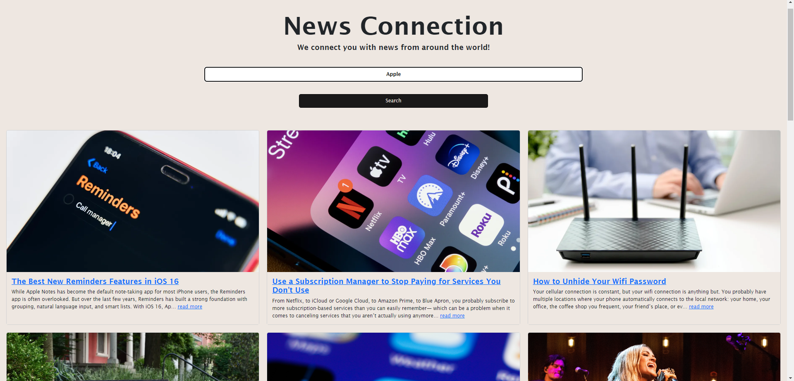

# News Connection

## Description 
This is a web-based application built for getting news from around the world. This app allows users to search for news of their choice. The results are sorted by popularity. 

# Built With
- React.js
- HTML
- CSS
- JavaScript
- Node.js
- NewsAPI
- Bootstrap

# Screenshot


# Contributions 
Contributions, issues, and feature requests are welcome!

# Installation
1. Clone the application
```bash
git clone https://github.com/MuboHouston/news-app.git
```

2. Change the working directory
```bash
cd news-app
```

3. Run Application
```bash
npm start
```
